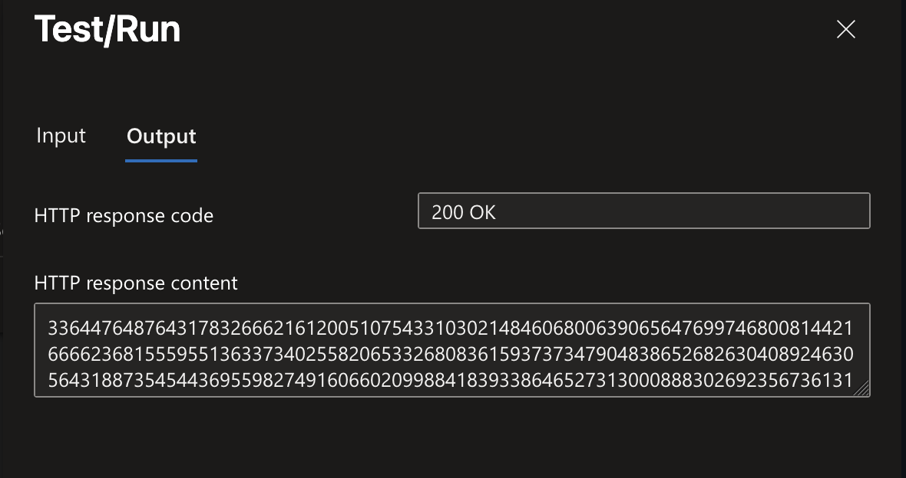
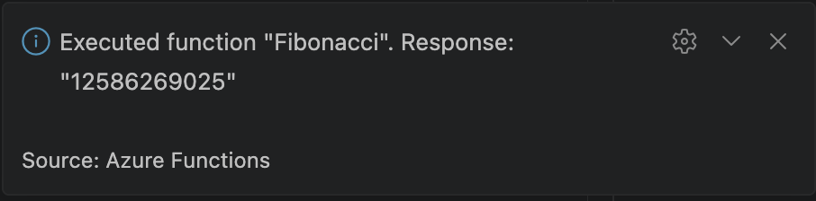
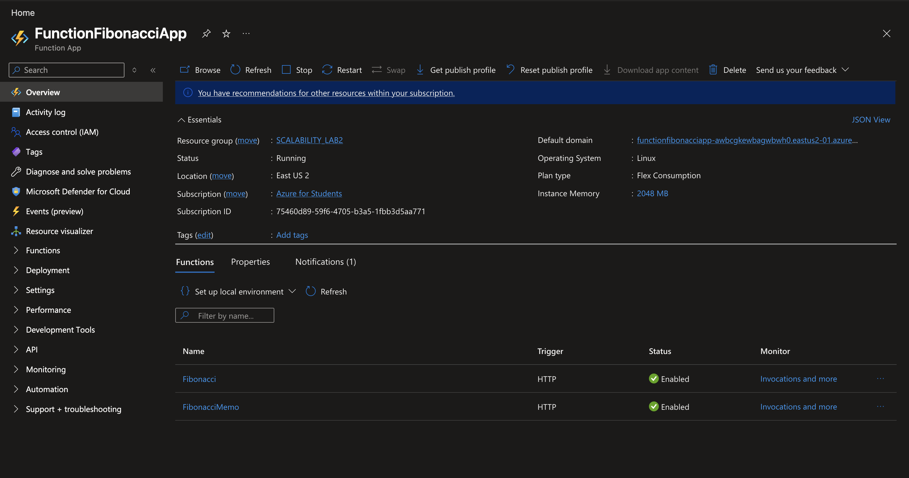
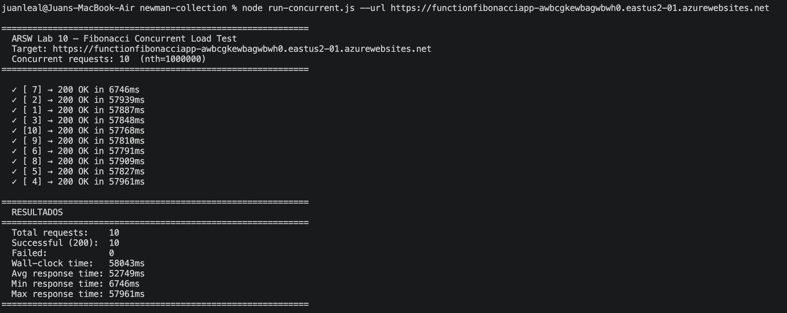
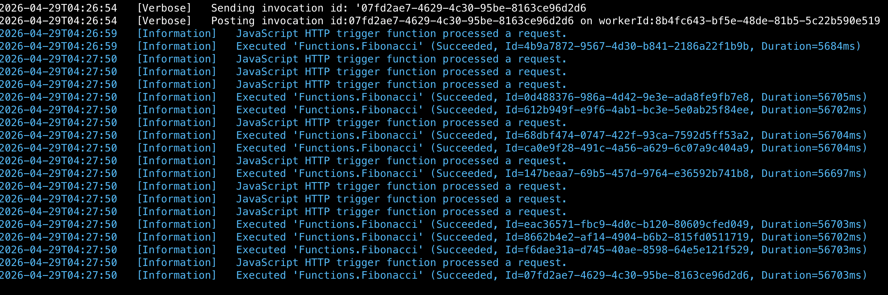
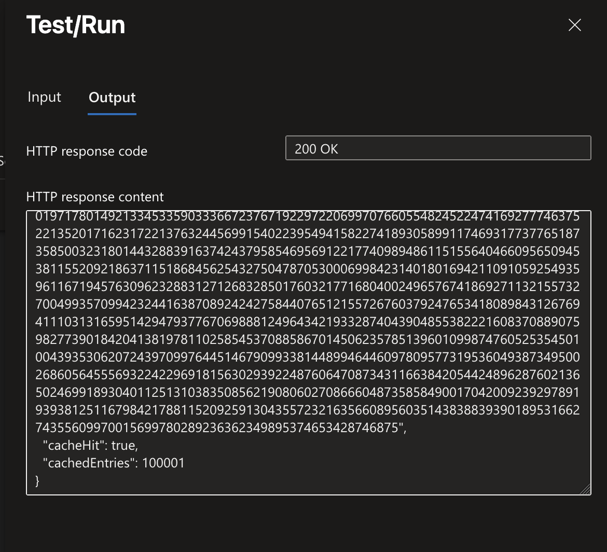
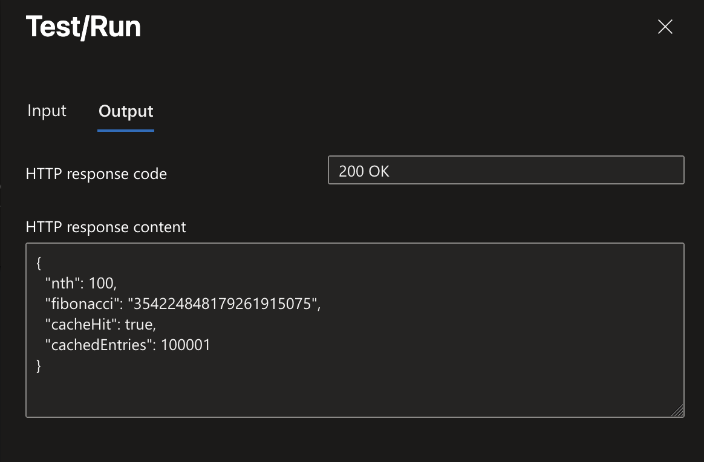
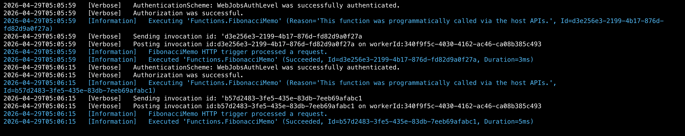
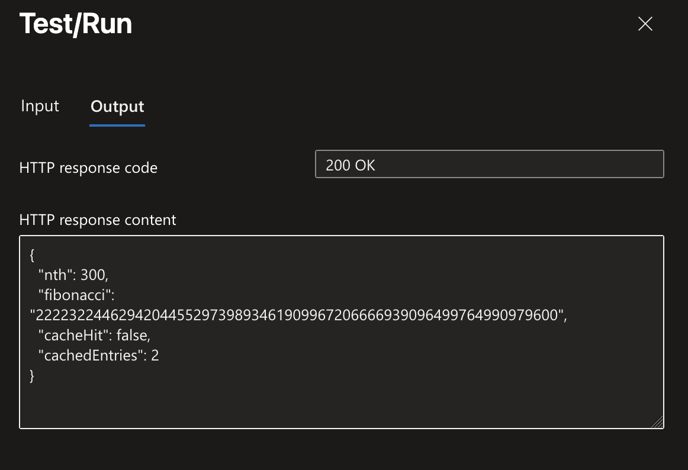

# **Laboratorio 10 - Load Balancing Parte 2**

**Escuela Colombiana de Ingeniería Julio Garavito**  
Arquitectura de Software — ARSW | Abril 2026

**Elaborado por**  
Juan Carlos Leal Cruz

## **Generalidades del Lab**
### **Prerrequisitos**
Para la correcta ejecución de este laboratorio se debe de contar con lo siguient:
- Node.js 18+
- Azure CLI con sesión activa (`az login`)
- Azure Functions Core Tools v4: `npm install -g azure-functions-core-tools@4`
- Newman: `npm install -g newman`
- Function App desplegado en Azure (plan Consumption)
  
### **Estructura del repositorio**
```
ARSW_Lab10_Load_Balancing/
├── FunctionProject/
│   ├── Fibonacci/              # Función iterativa original
│   │   ├── index.js
│   │   └── function.json
│   ├── FibonacciMemo/          # Función con memoization (nueva)
│   │   ├── index.js
│   │   └── function.json
│   ├── host.json
│   └── package.json
└── newman-collection/          # Pruebas concurrentes
    ├── fibonacci-collection.json
    └── run-concurrent.js
```

### **Prueba del despliegue**
Luego de seguir las instrucciones dadas por el profesor podemos probar la función de Fibonacci para corroborar que en efecto se subió correctamente a Azure:


Y también desde Visual Studio Code podemos probar:


---
## **Parte 1. Prueba concurrente con Newman**
### **1. Instalar dependencias del runner**
```bash
cd newman-collection
npm install newman
```

### **2. Ejecutar 10 peticiones concurrentes**
El script `run-concurrent.js` dispara 10 Promises simultáneas con `Promise.all()`, cada una ejecutando una corrida de Newman contra `/api/Fibonacci`. El valor `nth` se pasa como variable de entorno a la colección, reemplazando `{{nthValue}}` en el body del request.

```bash
node run-concurrent.js --url https://functionfibonacciapp-awbcgkewbagwbwh0.eastus2-01.azurewebsites.net

# También se puede especificar nth explícitamente:
node run-concurrent.js --url https://<APP>.azurewebsites.net --nth 1000000
```

Al ejecutar estos comandos, la terminal registrará en tiempo real el resultado individual de cada una de las 10 peticiones concurrentes a medida que la infraestructura en la nube las procese. Una vez que todas las promesas concluyen, el script imprime un reporte estadístico consolidado que detalla la cantidad de ejecuciones exitosas y fallidas, junto con los tiempos de respuesta mínimo, máximo y promedio, entregando una visión clara del rendimiento de la función bajo estrés.

### **3. Intepretar los resultados**
- Cada línea muestra `✓`/`✗`, número de request, HTTP status y tiempo de respuesta.
- El resumen final reporta: total, exitosos, fallidos, wall-clock y estadísticas de tiempo.
- Wall-clock ≈ petición más lenta (no la suma), lo que confirma ejecución paralela real.

## **Parte 2. FibonacciMemo - Función con Memorización**
### **1. `index.js` y `function.json`**
El archivo de configuración JSON actúa como el contrato de comunicación de la API. Define un desencadenador HTTP público con autorización anónima, permitiendo que el endpoint reciba peticiones GET y POST sin requerir credenciales. Asimismo, establece el canal de salida para asegurar que el sistema devuelva una respuesta HTTP estructurada al cliente tras finalizar el procesamiento.

El script principal en Node.js maneja las solicitudes y ejecuta la lógica matemática apoyándose en la librería big-integer para procesar cifras masivas sin perder precisión. El cálculo numérico se realiza mediante un algoritmo iterativo, diseñado específicamente para reemplazar la recursividad tradicional y evitar desbordamientos en la pila de llamadas (stack overflow) al evaluar posiciones extremadamente altas dentro de la secuencia.

La máxima eficiencia del sistema radica en su estrategia de caché persistente, o memoización, implementada a nivel de módulo. Al mantener un historial de resultados en memoria entre distintas ejecuciones, el algoritmo retoma los cálculos de nuevas peticiones desde el último valor conocido en lugar de empezar desde cero, reduciendo drásticamente la carga de procesamiento antes de retornar el enorme número resultante junto con sus métricas de diagnóstico.

### **2. Redesplegar a Azure**
Como esta funcion es un nuevo añadido al proyecto, se debe de hacer lo sq¿iguiente:
```bash
cd FunctionProject
func azure functionapp publish functionfibonacciapp-awbcgkewbagwbwh0
```

Azure detecta automáticamente todas las subcarpetas con `function.json` y registra ambas funciones.

### **3. Verificar en el portal**
En `portal.azure.com` dentro del Function App creada deben de aparecer ambas funciones: `Fibonacci` y `FibonacciMemo`.


### **4. Secuencia de pruebas**
```bash
# 1. Primera llamada — instancia fría, cache vacío
curl -X POST https://<APP>.azurewebsites.net/api/FibonacciMemo \
  -H "Content-Type: application/json" \
  -d '{"nth": 100000}'
# Esperado: "cacheHit": false

# 2. Segunda llamada inmediata — instancia caliente, cache hit
# Repetir el mismo curl
# Esperado: "cacheHit": true, tiempo < 10 ms

# 3. Esperar 5+ minutos sin actividad

# 4. Tercera llamada — instancia reciclada, cache perdido
# Repetir el mismo curl
# Esperado: "cacheHit": false nuevamente
```

De igual forma dentro del mismo portal de azure se pueden realizar estas mismas pruebas usando la parte `Test/Run` dentro de la función y se verán reflejados los mismos resultados.

---
## **Preguntas Conceptuales**
### **1. ¿Qué es una Azure Function?**
Una Azure Function es una unidad de cómputo serverless de Microsoft Azure que permite ejecutar código en respuesta a eventos (triggers) sin aprovisionar ni administrar servidores. Soporta múltiples lenguajes (JavaScript/Node.js, Python, C#, Java) y se integra con otros servicios de Azure mediante bindings declarativos definidos en `function.json`. El desarrollador solo escribe la lógica de negocio; la plataforma gestiona instancias, escalado automático y alta disponibilidad.

### **2. ¿Qué es serverless?**
Serverless es un modelo de ejecución en la nube donde el proveedor administra completamente la infraestructura: aprovisionamiento, escalado, parches y disponibilidad. El desarrollador entrega código, no servidores. El término es engañoso — hay servidores físicos, pero son totalmente transparentes para el desarrollador.

Características clave:
- Facturación por uso real: tiempo de ejecución + número de invocaciones, no por servidor reservado.
- Escalado automático: desde cero hasta N instancias según la demanda, sin intervención manual.
- Responsabilidad operativa mínima**: el equipo solo gestiona el código.

### **3. ¿Qué es el runtime y qué implica seleccionarlo al crear el Function App?**
El runtime es el entorno de ejecución que interpreta y corre el código. En Azure Functions existe una versión del host (v1, v2, v3, v4) que determina:

| Aspecto | Implicación |
|---|---|
| Lenguajes y versiones soportadas | v4 soporta Node.js 18/20, Python 3.9–3.11, .NET 8 isolated |
| APIs del SDK | Objeto `context`, bindings, middleware disponibles |
| Extension bundle | Definida en `host.json` — `"[4.0.0, 5.0.0)"` para v4 |
| Modelo de worker | In-process vs isolated worker process |

**Implicación práctica**: una vez creado el Function App con un runtime, migrarlo requiere recrear el recurso o seguir pasos manuales delicados. Para este laboratorio se usó Node.js 18 con runtime v4.

### **4. ¿Por qué es necesario crear un Storage Account de la mano de un Function App?**
Azure Functions usa el Storage Account para múltiples tareas críticas de infraestructura:

| Uso | Detalle |
|---|---|
| **Paquete de despliegue** | El código subido con `func publish` se almacena como ZIP en un blob container |
| **Coordinación de triggers** | Timer triggers y Durable Functions usan blobs y queues para distribuir estado entre instancias |
| **Logs internos del host** | El host escribe checkpoints y archivos de log en Table Storage |
| **Durable Functions** | El estado de orquestaciones y entidades se persiste en Table Storage |
| **Lease de instancias** | Evita procesamiento duplicado en triggers distribuidos mediante blob leases |

Sin Storage Account el Function App **no puede arrancar** — es un requisito no negociable independientemente del plan elegido.

### **5. ¿Cuáles son los tipos de planes para un Function App? ¿En qué se diferencian?**
| Característica | Consumption | Premium (EP) | Dedicated (App Service) |
|---|---|---|---|
| Escala a 0 | Sí | Mín. 1 instancia | No |
| Cold start | Sí (1–3 s) | No (pre-calentado) | No |
| VNet Integration | No | Sí | Sí |
| Timeout máximo | 10 minutos | 60 min (configurable) | Ilimitado |
| Memoria por instancia | ~1.5 GB | 3.5–14 GB (EP1–EP3) | Según plan ASP |
| Facturación | Por ejecución + GB·s | Por hora de instancia | Fijo mensual del ASP |
| Costo en reposo | $0* | ~$0.17/h (EP1 mín.) | Fijo independiente del uso |

**Consumption**
- Costo cero cuando no hay tráfico — Ideal para workloads intermitentes.
- Escala automáticamente sin configuración hasta cientos de instancias.
- Cold starts de 1–3 s en instancias nuevas — Inaceptable para APIs de baja latencia.
- Timeout máximo de 10 minutos — no sirve para procesos de larga duración.
- Sin integración VNet nativa.

**Premium (EP)**
- Sin cold start gracias a instancias pre-calentadas siempre activas.
- VNet Integration, Private Endpoints y mayor CPU/RAM disponibles.
- Ejecuciones de hasta 60 min (ilimitado con configuración).
- Costo mínimo siempre activo (~$120+/mes para EP1) aunque no haya tráfico.
- Mayor complejidad de configuración.

**Dedicated (App Service)**
- Control total del entorno, sin límites de tiempo de ejecución.
- Puede compartir plan con otras apps, optimizando costos si hay múltiples servicios.
- No escala a cero — costo fijo mensual independiente del uso.
- No es "verdaderamente serverless" — Requiere gestión del plan subyacente.
  
### **6. ¿Por qué la memoization falla o no funciona correctamente en serverless?**
La memoization almacena resultados en un `Map` a nivel de módulo Node.js (memoria del proceso). Esta estrategia funciona en aplicaciones de larga vida como servidores Express, pero en serverless enfrenta tres problemas estructurales:

**Problema 1 — Ciclo de vida efímero de instancias**
El plan Consumption recicla instancias inactivas entre 5 y 20 minutos sin tráfico. Al reiniciar el proceso Node.js, el `Map` se destruye completamente. La siguiente invocación no encuentra ningún valor en cache y debe recalcular desde cero.

**Problema 2 — Escalado horizontal multi-instancia**
Bajo carga concurrente, Azure puede distribuir peticiones entre múltiples instancias simultáneas. Cada instancia tiene su propio heap de Node.js y su propia copia del `Map`. La instancia A no comparte estado con la instancia B: dos peticiones para el mismo `nth` pueden ir a instancias distintas, ambas calculando desde cero.

**Problema 3 — Límite de memoria del plan Consumption**
El plan Consumption asigna hasta ~1.5 GB por instancia. Almacenar todos los valores intermedios de Fibonacci para `nth=1,000,000` requiere mantener en memoria un millón de objetos BigInteger con cientos de dígitos, superando el límite disponible y provocando un error de OutOfMemory.

> **Solución correcta para producción**: usar un cache externo distribuido como **Azure Cache for Redis**, accesible por todas las instancias simultáneamente y persistente independientemente del ciclo de vida de cada instancia.

### **7. ¿Cómo funciona el sistema de facturación de las Function App?**
#### **Plan Consumption — Dos componentes independientes**
| Componente | Precio (2025) | Gratuito mensual |
|---|---|---|
| Ejecuciones | $0.20 / millón | 1 millón gratis |
| Consumo de recursos | $0.000016 / GB·s | 400,000 GB·s gratis |

**GB·s** = memoria asignada (GB) × duración de ejecución (segundos).
Ejemplo con la función de este lab (1.5 GB, ~57 s, 10 invocaciones):
- Ejecuciones: 10 → dentro del millón gratuito → **$0.00**
- Consumo: 10 × 1.5 GB × 57 s = 855 GB·s → dentro de los 400,000 gratuitos → **$0.00**

Para 1M invocaciones/mes con esos parámetros: 1.5 GB × 57 s × 1,000,000 = 85,500,000 GB·s × $0.000016 ≈ **$1,368/mes**

#### **Plan Premium — Por hora de instancia**
Se factura por hora de instancia según el SKU: EP1 ~$0.173/h, EP2 ~$0.346/h, EP3 ~$0.693/h. Siempre hay al menos 1 instancia activa.

#### **Plan Dedicated — Plan fijo del App Service**
Se paga el App Service Plan asociado (B1 ~$13/mes, S1 ~$73/mes, P1v3 ~$138/mes). Las funciones no tienen costo adicional por ejecución.

---
## **Informe de Resultados**
### **Parte 1 — Prueba de carga concurrente (Newman)**
Se ejecutaron 10 peticiones HTTP POST simultáneas con `Promise.all()` en Newman contra `/api/Fibonacci` con `nth=1,000,000`. Todas las peticiones se dispararon en el mismo tick del event loop de Node.js, garantizando concurrencia real.





#### Datos observados
| Request | HTTP Status | Tiempo de respuesta | Observación |
|---|---|---|---|
| [7]  | 200 OK | 6,746 ms  | Instancia caliente — cálculo rápido |
| [2]  | 200 OK | 57,939 ms | Instancia fría — cold start + cálculo |
| [1]  | 200 OK | 57,887 ms | Instancia fría — cold start + cálculo |
| [3]  | 200 OK | 57,848 ms | Instancia fría — cold start + cálculo |
| [10] | 200 OK | 57,768 ms | Instancia fría — cold start + cálculo |
| [9]  | 200 OK | 57,810 ms | Instancia fría — cold start + cálculo |
| [6]  | 200 OK | 57,791 ms | Instancia fría — cold start + cálculo |
| [8]  | 200 OK | 57,909 ms | Instancia fría — cold start + cálculo |
| [5]  | 200 OK | 57,827 ms | Instancia fría — cold start + cálculo |
| [4]  | 200 OK | 57,961 ms | Instancia fría — cold start + cálculo |

| Métrica | Valor |
|---|---|
| Total requests | 10 |
| Successful (200) | 10 |
| Failed | 0 |
| Wall-clock time | 58,043 ms |
| Avg response time | 52,749 ms |
| Min response time | 6,746 ms |
| Max response time | 57,961 ms |

#### Análisis

- **Request [7]** respondió en 6.7 s porque atrapó la instancia que ya estaba caliente de ejecuciones previas.
- **Los 9 requests restantes** tardaron ~58 s cada uno: costo real de calcular Fibonacci(1,000,000) con BigInteger en una instancia que acaba de arrancar en frío, sin caché del JIT de Node.js.
- **Wall-clock total fue 58 s** (no 580 s), confirmando que las 10 peticiones corrieron genuinamente en paralelo. Si fueran secuenciales, el total habría sido la suma de todos los tiempos individuales.
- **No hubo fallas**: todas las instancias completaron el cálculo dentro del timeout de 10 min del plan Consumption.

### **Parte 2 — FibonacciMemo con memoization**
Se desplegó `FibonacciMemo` al mismo Function App. La función usa un `Map` a nivel de módulo Node.js para cachear únicamente los valores `nth` solicitados explícitamente, sin almacenar los intermedios (evitando el OutOfMemory que ocurre al guardar todos los valores de 0 a n).

#### Prueba 1 — nth=100,000 (cache hit, instancia caliente con cache previo)
```json
{
  "nth": 100000,
  "fibonacci": "25974069347221724166...46875",
  "cacheHit": true,
  "cachedEntries": 100001
}
```
> La instancia ya tenía cache de una ejecución anterior. `cacheHit: true` y respuesta en milisegundos.



#### Prueba 2 — nth=100 (cache hit inmediato, misma instancia)
Al solicitar `nth=100` inmediatamente después, la respuesta fue:

```json
{
  "nth": 100,
  "fibonacci": "354224848179261915075",
  "cacheHit": true,
  "cachedEntries": 100001
}
```
La instancia seguía activa y el `Map` conservaba el estado. `nth=100` estaba cubierto porque la implementación almacenaba todos los intermedios de 0 a 100,000.



#### Logs de Azure — Evidencia de tiempos y misma instancia


Ambas invocaciones usaron el mismo `workerId` (`340f9f5c-...`), confirmando que la misma instancia de Node.js atendió los dos requests y el `Map` en memoria se mantuvo entre invocaciones.


#### Comportamiento tras 5+ minutos de inactividad
Tras un período de inactividad de 5 a 20 minutos el plan Consumption desaloja la instancia. Al reiniciar el proceso Node.js, el módulo se carga nuevamente desde disco y el `Map` queda vacío. La siguiente invocación devuelve `cacheHit: false` y `cachedEntries: 0`, recalculando el valor completo.



---

### **Limitación de memoria con nth=1,000,000**
Al intentar invocar `FibonacciMemo` con `nth=1,000,000` usando la implementación que almacenaba todos los valores intermedios (0 a n), la función falló:

```
2026-04-29T04:56:26 [Error] Executed 'Functions.FibonacciMemo'
  (Failed, Id=f7afc805-fd3d-4103-ae69-ccb3243c3b6a, Duration=1857ms)
  → RangeError: Out of memory
```

**Causa**: el plan Consumption limita la memoria a ~1.5 GB por instancia. Almacenar 1,000,000 objetos BigInteger con cientos de dígitos cada uno supera ese límite.

**Solución implementada**: cachear únicamente el valor explícitamente solicitado usando una ventana deslizante de dos variables para el cálculo. Esto reduce el uso de memoria del cache de O(n) a O(k), donde k es el número de valores distintos solicitados.

---

### **Conclusiones**

- Azure Functions con el plan Consumption escala automáticamente ante carga concurrente, distribuyendo peticiones entre instancias nuevas o existentes sin configuración manual.
- El cold start es el costo real del escalado en Consumption: en este lab, JIT de Node.js + cálculo BigInteger sumaron ~58 s en instancias nuevas frente a 6.7 s en una instancia caliente.
- La memoization en memoria funciona correctamente mientras la instancia permanece activa (6–7 ms para valores cacheados), pero no es confiable en serverless por el ciclo de vida efímero y el escalado multi-instancia.
- Para cache persistente y compartido entre instancias en producción, la solución correcta es **Azure Cache for Redis**.
- El límite de memoria del plan Consumption (~1.5 GB) impone restricciones concretas en algoritmos que requieren almacenar grandes estructuras — factor de diseño crítico al elegir este plan.
